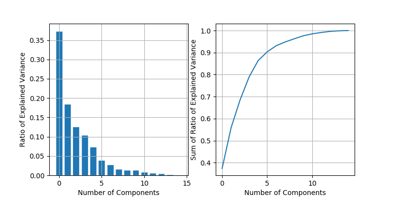
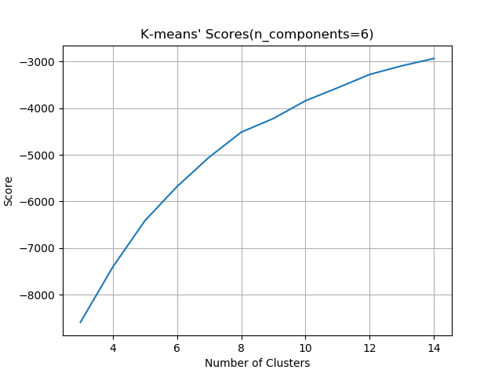

# 聚类分析

## PCA降维

选用不同主成分数目，进行PCA，其各主成分对应特征值作图如下，作图为特征值比例，右图为累积比例

PCA各主成分见文件`output/2_pca__components_.txt`，各主成分对应的权值见文件`output/2_pca_explained_variance_.txt`，各特征均值见`output/2_pca__mean_.txt`

## KMeans聚类

指定主成分数目为6，选用不同的簇数目，作图如下

各类别中心为`output/2_kmeans__cluster_centers_.txt`，经反变换后保存在`output/2_kmeans__cluster_centers_inv.txt`

## 参数

故最终参数为
- 主成分数目：6
- 聚类数目：8
