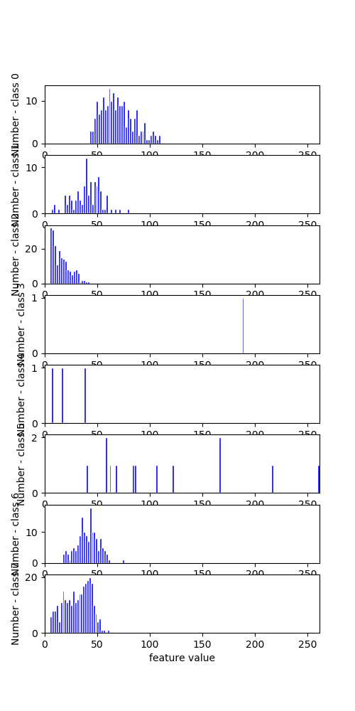
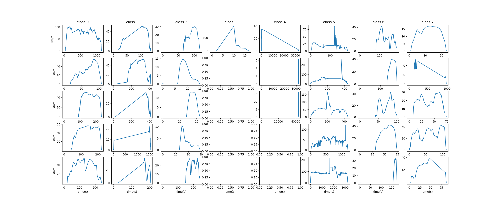
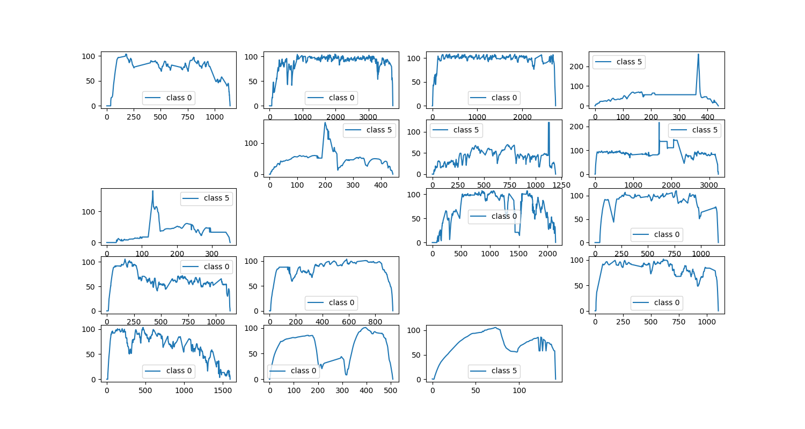

# 聚类直方图统计

## 删除异常类别

首先，由聚类结果，各类别峰值速度直方图统计如下

每类展示5个运动学片段如下

由上，删除类别标签为1、3、4、7的序列。

## 拟合GMM模型

删除异常类别后，重新聚类，聚类数目指定为 8 - 4 = 4，统计所有序列的峰值速度直方图

由上图，拟合GMM模型，做出其参数对应的曲线如下

由此，设定低速速度区间为$[0, 25], [25, 60], [60, +\inf]$。

## 高速片段展示

由于高速片段数目较小，应多关注，如下为速度高于100 km/h的运动学片段展示

