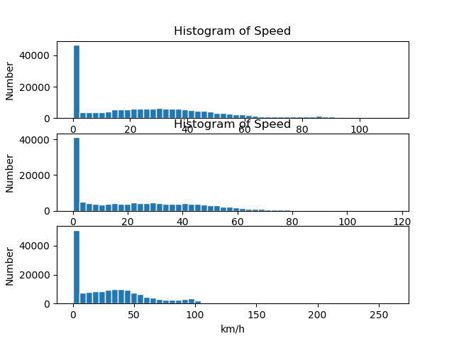
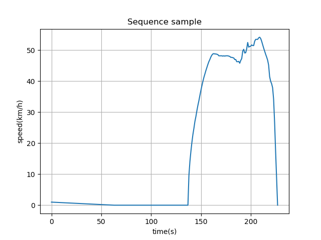
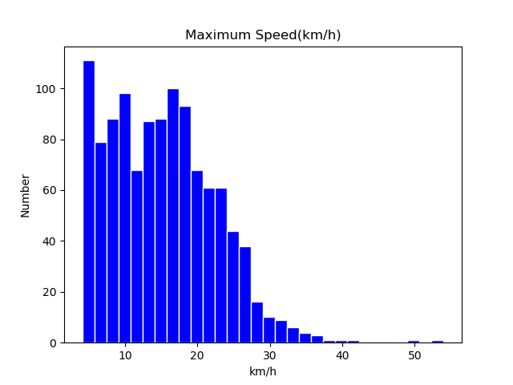
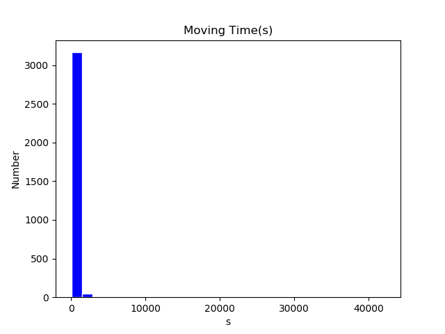

# 数据预处理

## 时间戳

调用`datetime.datetime.strptime(timestamp, "%Y/%m/%d %H:%M:%S")`将字符串时间戳转换为Unix时间戳。

## 速度值

1. 原始GPS测取数据；
2. 利用经纬度计算速度；

- 由于经纬度计算得到速度值噪声过多，故不考虑使用；
- 加速度计参数未使用；

原始数据中速度统计图如下

## 划分运动学片段

1. 按时间戳，将缺失的数据补齐，用线性插值方法补齐；
2. 设定速度阈值，小于该阈值视作怠速；
3. 运动学片段从**上一周期的减速结算结束**开始，到**这一周期的减速阶段结束**；

## 计算运动学片段特征

1. 若怠速时长大于阈值(180)，则剪裁速度值序列；
2. 计算以下参数，保存
    - 时长
    - 距离
    - 怠速时间比
    - 加速时间
    - 减速时间
    - 峰值速度
    - 平均运行速度
    - 平均速度
    - 速度标准差
    - 峰值加速度
    - 峰值减速度
    - 平均加速度
    - 加速度标准差
    - 平均减速度
    - 减速度标准差
  
所有运动学片段，峰值速度与运行速度直方图统计如下

