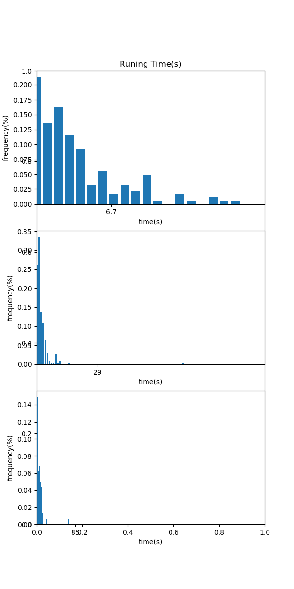
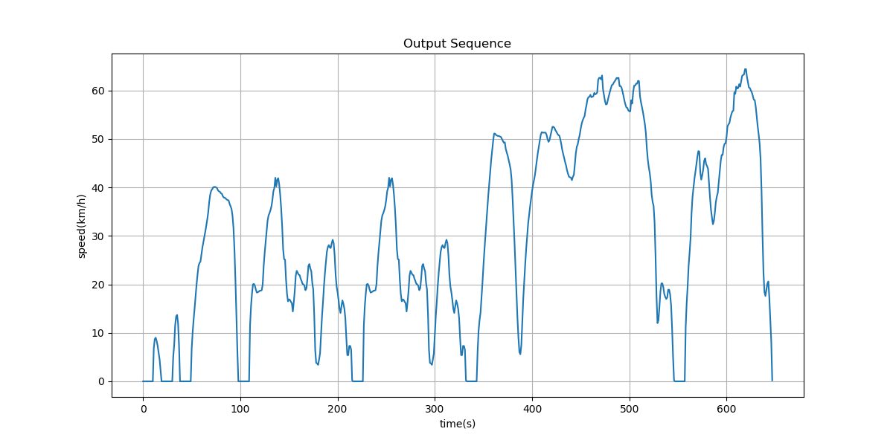
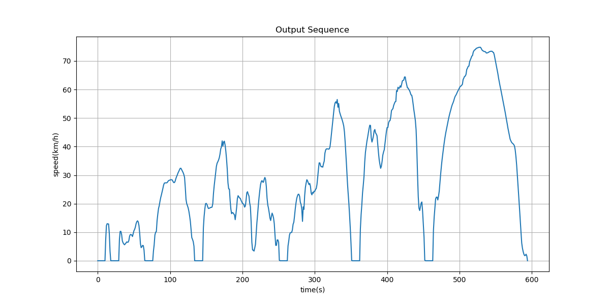
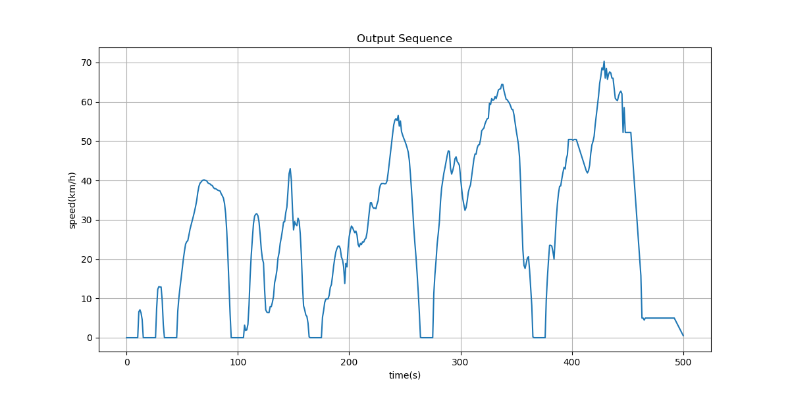
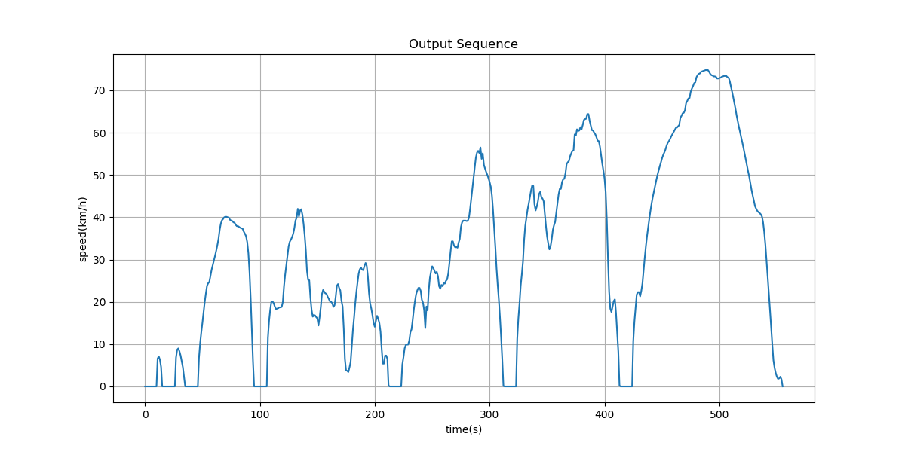
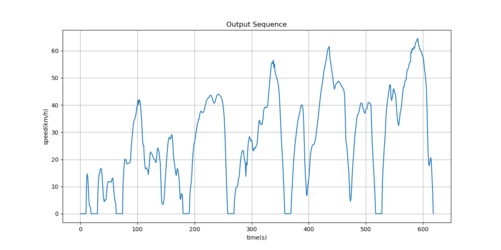

# 随机采样拼接

## 划分速度区间随机采样

根据histClustering指定的速度区间，统计各区间内峰值速度的频率直方图

## 指定各速度区间所需的序列数目

设第$k$区间段某序列$seq_k^{(i)}$的运动时间为${t_m}_k^{(i)}$，大致的总时间$T$，如1200秒，用下式计算各区间段所占时间

$$ T_k = \frac{\sum_{i \in C_k} {t_m}_k^{(i)}}{\sum_{i, k} {t_m}_k^{(i)}} \times T $$

计算该区间段内运动时间的均值

$$ t_k = \frac{1}{N_k} \sum_{i \in C_k} {t_m}_k^{(i)} $$

计算所需的序列数目

$$ N_k = \frac{T_k}{t_k} $$

统计第$k$区间内的，依据频率，对序列进行$N_k$次采样

## 几次采样的拼接序列展示如下

